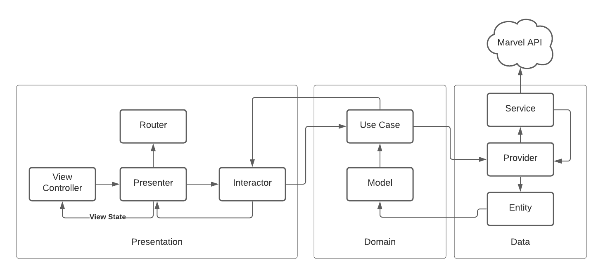

# MarvelApp

iOS application that shows all marvel characters and allows to filter by name and show detailed information when select them    

## Requirements

- macOS 10.15+
- iOS 14.0+
- Xcode 12.0+
- XcodeGen 2.0+

## Installation

- Open a terminal
- Browse to the project root folder (it contains the project.yml file)
- Run xcodegen on terminal
- Open the generated MarvelApp.xcodeproj file
- Enjoy!

## Architecture

This project was created using VIPER

## Dependencies

- **[Moya](https://github.com/Moya/Moya)**
- **[SDWebImage](https://github.com/SDWebImage/SDWebImage.git)**
- **[SkeletonView](https://github.com/Juanpe/SkeletonView.git)**
- **[Resolver](https://github.com/hmlongco/Resolver.git)**
